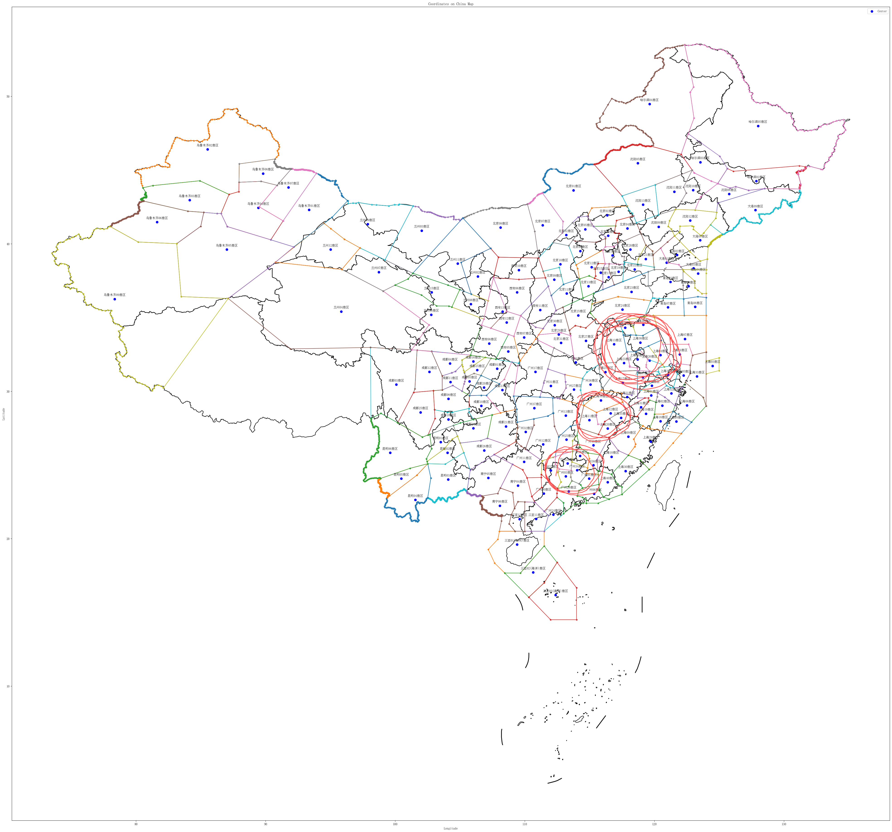

## 基于遗传编程的动态航空流量调控方法

### 课题背景
预先制定的航班路线很容易受到**突发事件**的干扰，而受到干扰后如何重新规划新的路线，目前来看往往依赖航路点空管员的经验。  
本课题期望通过遗传编程的方式，**演化出一条启发式规则**（从代码角度来看就是一个表达式），当航班到达某航路点，需要重新规划航线时，通过该规则，即可选出下一个最佳（从整体的航班延时角度看）的航路点
### 前置知识 
#### 代码层面
* [simpy库必学](https://simpy.readthedocs.io/en/latest/)  
一个python的离散事件仿真库，该课题的仿真主要基于该库进行  
* [deap库必学](https://deap.readthedocs.io/en/master/index.html)  
一个python的遗传编程库，该课题的演化机制基于deap展开
#### 课题层面([下载链接](https://pan.baidu.com/s/1a_K9QZkYlvHVc2-kPVJP_w?pwd=0917))
* 专利 —— 一种动态航空流量调控方法 **(必读)**  
该专利是在裸GP的基础上添加了多树GP机制，阅读该专利，主要理解其中使用到的变量与整体的演化流程，测试流程   

* 论文 —— Genetic Programming with Multi-fidelity Surrogates for Large-scale Dynamic Air Traffic Flow Management **(必读)**  
师兄刚发表的论文，在裸GP上添加有代理模型机制，阅读该论文，主要理解课题背景  

* 论文 —— Genetic Programming with Multi-tree
Representation for Dynamic Flexible Job Shop
Scheduling **(选读)**  
多树GP机制的来源

* 论文 —— Uncertain Commuters Assignment Through Genetic
Programming Hyper-Heuristic **(选读)**   
搭建仿真模型时的主要参考

### 目录结构
```
.
├── 专利论文
├── Simulator   仿真用到的工具
├── Simulate.py 仿真的主函数
├── resource  
│   ├── usedtrajectory03.csv 从真实数据中挑选出的航班，会按时添加到仿真模型中
│   ├── Dijkstra.txt 按照Dijkstra算法，只考虑点间距离得到的航班路线
│   ├── HistoryTra.txt 实际航班路线
│   ├── ShortestLenth.txt 点间直线距离
│   └── WithVirtualNode.csv 添加虚拟节点后各个扇区中心点的编号，经纬坐标，邻居扇区中心点，以及是真实or虚拟节点 
├── GraphConstrut.py 由WithVirtualNode.csv构图，只有邻居节点可以成线
└── GP.py 演化主函数，Simulate.py最终只是提供给GP演化过程中的目标函数
├── .gitignore
└── readme.md
```
### 使用方法
``` bash
python3 GP.py 即可开始演化，最后会返回演化得到的最佳规则
eg: add(sub(P2N, P), add(P_, S))
建议先将GP中的popnum(41行)与进化代数(100行)设小
比如种群个体设为3, 进化代数设为5，看程序能不能跑通
```
### tips(持续更新)
* 这个项目在仿真时的整体逻辑是 
  1. 挑选航班数据，拿到要仿真的航班计划——`usedtrajectory03.csv`
  2. 处理扇区节点，构造航空网络图——`WithVirtualNode.csv`
  3. 扇区容量随机扰动，基于simpy仿真航班路径——`Simulate.py`  
   
  目前这3步其实已经做完了。
  其实就是提供给GP一个目标函数，GP只关心最终返回的仿真结果，即`simulate.end`时间内完成的航班数量，后续更高级的优化机制往往通过更改GP中的进化策略即可
* 现在usedtrajectory03.csv中用到的航班是我根据某天实际航班挑选出来的，只有几千架次，如果有需要其他的实际航班，可以通过云盘下载，[下载链接](https://pan.baidu.com/s/10B-72YiZ2SPCCidx3ZxAIg?pwd=0917)
* 强烈建议先看完前置知识再上手代码，不然会不知道某些参数某些成员变量的意义
* 可以先理解一下.txt .csv等数据意义
* 可以先根据报错安装必须的库，都可以通过```pip```工具安装
* 虽然在GP中已经通过python的`多进程pool`进行了并行加速，但是每次仿真依然耗时较长。`simulate.end`控制了会仿真到第`end`分钟，越大耗时越长，后续可以优化如何加速

* 关于为什么需要虚拟节点:  
        
        真实节点是我国每个扇区的几何中心节点，虚拟节点是扇区连接线上的中心点。  
        我们通过随机扰动扇区的容量来模拟实际的天气等影响，没有虚拟节点，
        两真实节点间的最大可容纳流量不好计算，因为两扇区被扰动后的容量不一致。
        而有虚拟节点后，扇区1到虚拟节点的最大流量由扇区1控制，
        虚拟节点到扇区2的最大流量由扇区2控制，方便仿真
* 扇区及扇区节点分布图
  

  